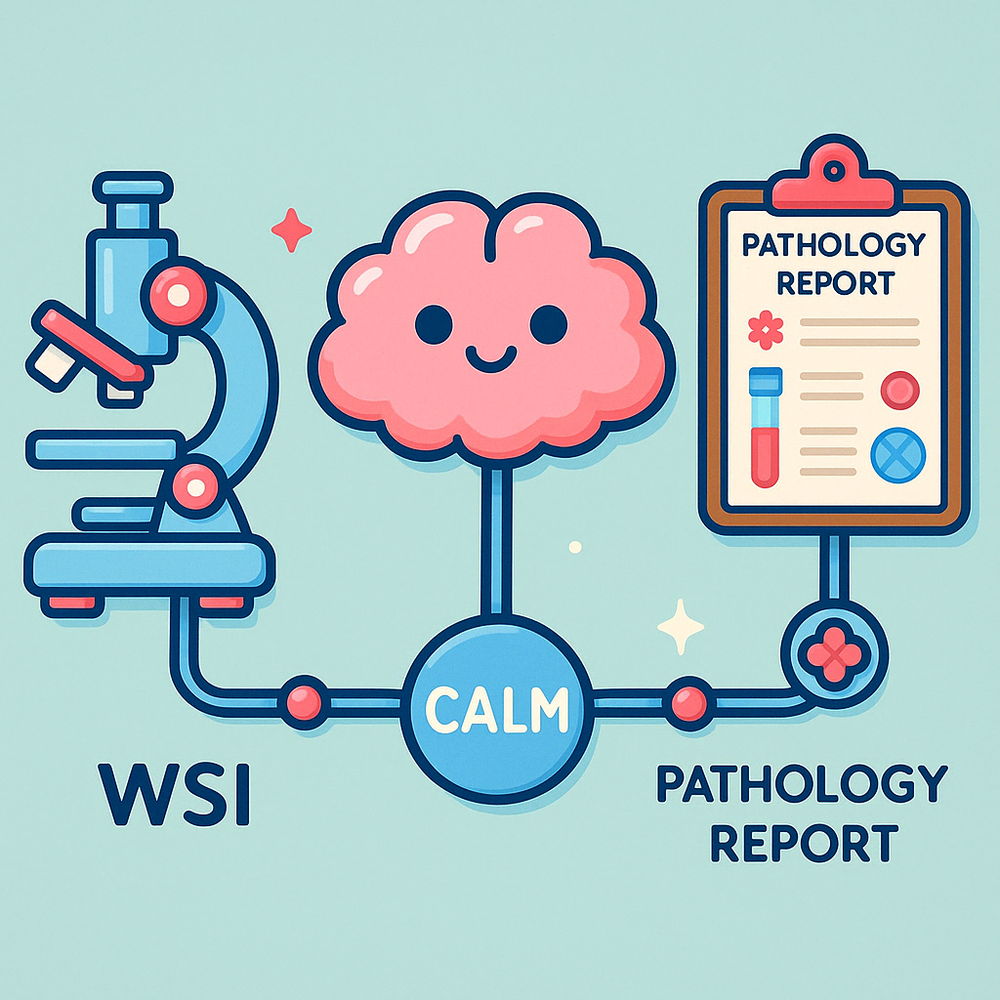
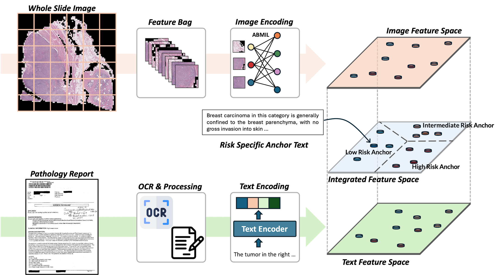
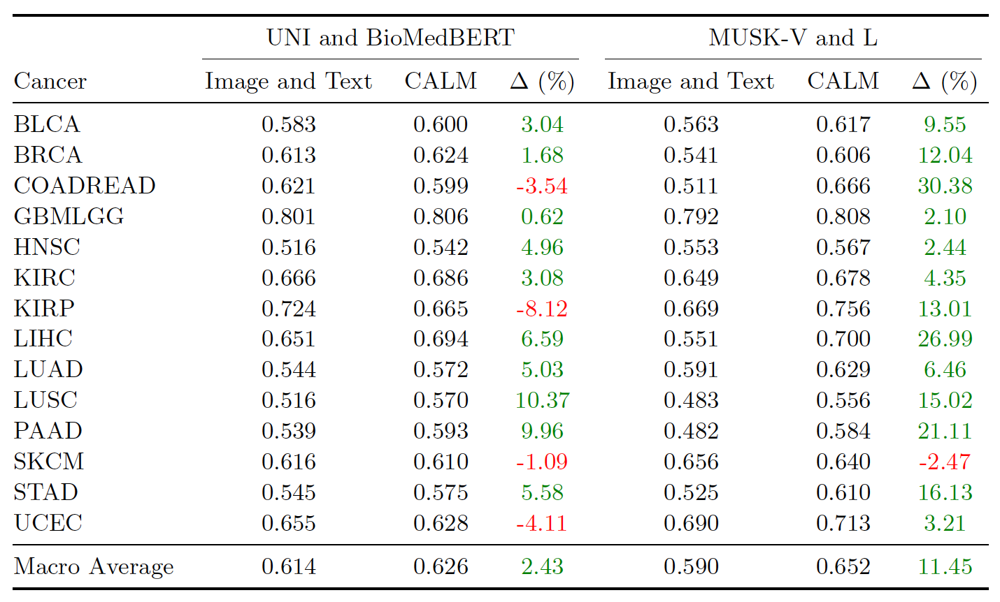
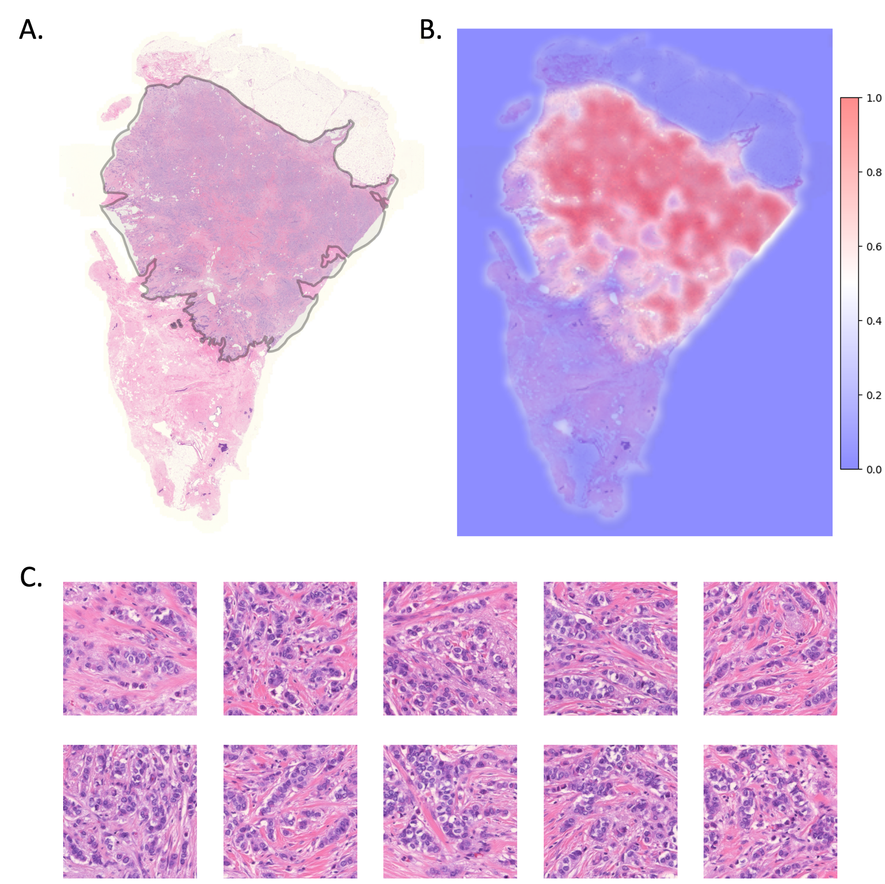

# CALM 
&nbsp;**C**linical **A**nchor text guided model **L**earning for **M**ulti-modal prognosis prediction
&nbsp; 
&nbsp;


## 🔍 Overview
CALM is a multi-modal prognosis prediction framework that integrates **whole slide images (WSIs)** and **pathology reports** using **anchor text–guided alignment**.  
It is designed to be:  
- **Clinically scalable**: leverages routine WSIs and pathology reports without relying on costly omics profiling.  
- **Anchor text–driven**: employs structured, LLM-refined clinical anchors to improve stability and interpretability.  
- **Foundation model compatible**: supports both general vision encoders (e.g., UNI) and pathology-specific vision–language encoders (e.g., MUSK).  

<p align="center">
  
</p>


## 📊 Performance
CALM demonstrates consistent improvements across 14 cancer types compared to image–text baselines.  

<p align="center">
  
</p>

---

## ⚙️ Installation
```bash
git clone https://github.com/your-repo/CALM.git
cd CALM
pip install -r requirements.txt
pip install fairscale git+https://github.com/lilab-stanford/MUSK
```

🚀 Running the Code
Example scripts are provided in:
- run_experiments_musk_musk.sh
- run_experiments_uni_bert.sh

For example, to run CALM on TCGA-BLCA using the MUSK vision–language encoder:
```
CUDA_VISIBLE_DEVICES=0 nohup python ./run.py \
    --config config/OS_MUSK/config_blca.yaml \
    > logs/TCGA-BLCA_MUSK_MUSK.log &
```

## 🔗 Cross-Modality Alignment
CALM learns fine-grained alignment between patch-level histology and structured pathology text.

<p align="center">  </p>

Attention heatmap of CALM aligned with pathology reports.
Example from TCGA-OL-A66K pathology report summary:

```
“The tumor in the right breast has three mass lesions measuring 4.4 cm, 2 cm, and 1 cm. Moderately differentiated (SBR grade II), with associated intraductal carcinoma in situ (LCIS); no evidence of invasion into adjacent tissues or organs; no lymph node metastasis (0/2 sentinel nodes); resection margins negative, closest margin >1.5 mm for invasive carcinoma.”
```

Using the CLS token, we generated an image-level attention heatmap showing correspondence between histology and the diagnostic text. 

- **A.** Pathologist-provided tumor annotation. 
- **B.** Attention heatmap between image and pathology report, with warmer (red) regions corresponding to higher attention weights. 
- **C.** Representative top-10 highest-attention patches, highlighting regions most aligned with the report.