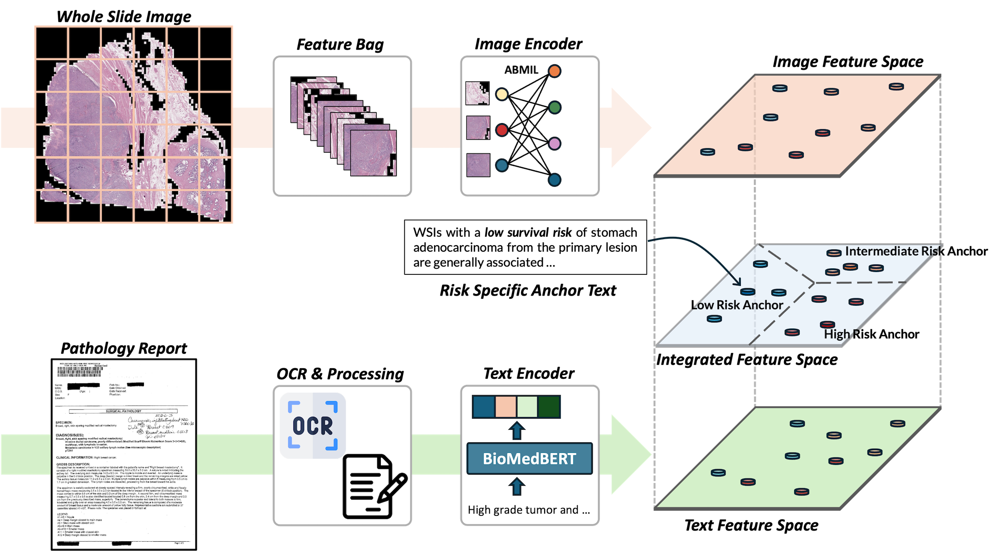

# CALM 
&nbsp;**C**linically **A**ligned model **L**everaging **M**ulti-modality
&nbsp; 
&nbsp;

## Overview of CALM
**CALM** is a vision-language prognosis (overall survival; OS) prediction model that leveraging paired WSIs and corresponding free-text pathology reports. Unlike datasets designed for academic research, such as WSI-omics pairs, WSI-pathology report pairs are routinely collected in clinical environments, making CALM more aligned with real-world clinical workflows. 


## Abstract
Prognosis prediction using hematoxylin and eosin (H&E)-stained  whole slide images (WSIs) has seen significant progress, particularly through the integration of omics data. However, omics profiles are not routinely collected in clinical workflows, limiting real-world applicability. In contrast, pathology reports are generated as part of standard diagnostic assessment. These reports contain expert interpretations of WSIs and often incorporate clinical insight, making them a widely available but underutilized resource in computational modeling. Their use in multi-modal prognostic models has been limited due to challenges related to unstructured text formats and variability in report length.

To address these limitations, we propose CALM, a lightweight and clinically grounded model that combines WSIs and pathology reports for pancancer prognosis prediction. CALM leverages pretrained encoders with support for long-context inputs and introduces large language model-generated diagnostic descriptions to guide cross-modal representation learning. Across 14 cancer types, CALM outperforms image-only models and achieves comparable performance to omics-based approaches, despite using only 6.8 million trainable parameters. CALM demonstrates the potential of free-text pathology reports as a scalable and effective modality for clinical prognostic modeling.

## Performances
| Project  | ResNet-50 Image Only    | ResNet-50 Image + Text      | UNI Image Only            | UNI Image + Text            |
|----------|-------------------------|-----------------------------|---------------------------|-----------------------------|
| BLCA     | 0.519 (0.504–0.535)     | **0.565 (0.544–0.587)**     | 0.554 (0.528–0.580)       | **0.587 (0.574–0.601)**     |
| BRCA     | 0.520 (0.501–0.539)     | **0.578 (0.557–0.599)**     | 0.599 (0.574–0.624)       | **0.643 (0.622–0.663)**     |
| COADREAD | 0.540 (0.504–0.576)     | **0.591 (0.559–0.622)**     | 0.623 (0.580–0.667)       | **0.654 (0.617–0.691)**     |
| GBMLGG   | 0.680 (0.670–0.691)     | **0.774 (0.762–0.787)**     | 0.772 (0.752–0.792)       | **0.792 (0.783–0.800)**     |
| HNSC     | 0.502 (0.486–0.518)     | **0.540 (0.525–0.555)**     | 0.548 (0.523–0.574)       | **0.561 (0.548–0.575)**     |
| KIRC     | **0.524 (0.496–0.552)** | 0.515 (0.487–0.544)         | 0.633 (0.613–0.654)       | **0.674 (0.656–0.692)**     |
| KIRP     | 0.563 (0.528–0.597)     | **0.649 (0.602–0.696)**     | **0.734 (0.714–0.755)**   | 0.722 (0.689–0.756)         |
| LIHC     | 0.557 (0.537–0.576)     | **0.650 (0.626–0.674)**     | **0.673 (0.661–0.686)**   | 0.673 (0.655–0.692)         |
| LUAD     | **0.549 (0.519–0.578)** | 0.537 (0.509–0.566)         | 0.546 (0.527–0.566)       | **0.547 (0.527–0.567)**     |
| LUSC     | 0.517 (0.512–0.522)     | **0.535 (0.510–0.561)**     | 0.521 (0.508–0.533)       | **0.550 (0.534–0.566)**     |
| PAAD     | 0.495 (0.455–0.536)     | **0.550 (0.530–0.570)**     | 0.507 (0.489–0.526)       | **0.532 (0.513–0.552)**     |
| SKCM     | 0.468 (0.435–0.500)     | **0.600 (0.572–0.627)**     | 0.594 (0.569–0.619)       | **0.616 (0.591–0.641)**     |
| STAD     | 0.529 (0.509–0.550)     | **0.539 (0.525–0.553)**     | **0.580 (0.565–0.595)**   | 0.552 (0.533–0.572)         |
| UCEC     | 0.477 (0.449–0.504)     | **0.608 (0.583–0.633)**     | 0.659 (0.648–0.669)       | **0.661 (0.636–0.685)**     |
| **Average** | 0.531                | **0.588**                   | 0.610                     | **0.626**                   |

Overall, combining image and text consistently improved performance compared to image-only models. 
- **CALM (ResNet-50)** achieved a **10.7%** improvement in c-index on average (from 0.531 to 0.588).
- **CALM (UNI)**, leveraging a pathology-specific image encoder, showed a **2.6%** gain (from 0.610 to 0.626).
- Performance improved in 12 out of 14 cancer types with ResNet-50 and in 11 out of 14 with UNI when text was added.

## Diagnostic Description and Knowledge-Guided Pooling
To improve cross-modal alignment, CALM incorporates **diagnostic descriptions**—LLM-generated textual summaries that capture key morphological and prognostic features specific to each cancer type and risk level (e.g., low, intermediate, high). These descriptions serve as **static semantic anchors** during training and guide the alignment between image and text representations through a **knowledge-guided pooling** mechanism. Unlike simple class labels, diagnostic descriptions offer rich, interpretable context that helps disambiguate redundant or noisy clinical narratives. Empirically, their inclusion consistently improved model performance, highlighting their value in enhancing multi-modal representation learning.


## Installation & Run
CALM was developed using Python (v3.10).

To install and run CALM, please follow the installation instructions as follows:

```
git clone https://github.com/jonghyunlee1993/CALM
cd CALM
pip install -r requirements.txt
```

To run CALM, you first need to extract patch features. Please use the [CLAM toolbox](https://github.com/mahmoodlab/CLAM) for patch-level feature extraction.

After preparing the extracted patch instances, you can train CALM using the following command:

`CUDA_VISIBLE_DEVICES=0 nohup python ./run.py --config config/OS_UNI/config_blca.yaml --results_path results/ABMIL_UNI --num_workers 6 --use_sampler True --image_encoder ABMIL --loss_lambda 0.1 --cont_loss cosine --temperature 1.0 --diagnostic_data data/diagnostic_description.csv > logs/blca_ABMIL_UNI.out &`

Example execution codes are provided in `run_experiments.sh`.

## Dataset
The WSIs used for training and validation of **CALM** are publicly available from the [GDC Data Portal](https://portal.gdc.cancer.gov/).  
The train-test split information and source code for **PORPOISE** can be found in the official [GitHub repository](https://github.com/mahmoodlab/PORPOISE).  
The digitized pathology reports are available from the [TCGA-Reports GitHub repository](https://github.com/tatonetti-lab/tcga-path-reports).